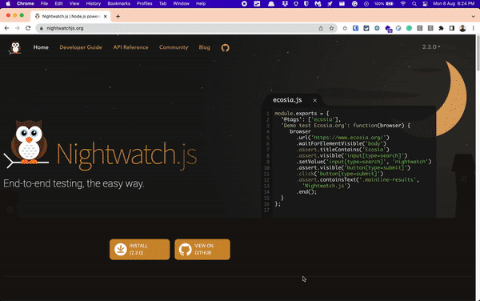

# Nightwatch Chrome Recorder

[](https://github.com/vaibhavsingh97/nightwatch-chrome-recorder/actions/workflows/build.yml)

This repo provide tools to export Nightwatch test from Google Chrome Devtools Recordings

✅ Converts multiple recordings to Nightwatch tests in one go (out-of-the-box glob support)  
🗂 User can pass their custom path to export tests.  
💃 Users can also use a dry run to see the interim output of the recordings  
👨‍💻 Programmatic API which users can use in their own project to create plugins or custom scripts.

## 📹 Demo



## 🏗 Installation

```sh
npm install -g @nightwatch/chrome-recorder
```

## 🚀 Usage

To quickly run the interactive CLI, run:

```sh
npx @nightwatch/chrome-recorder
```

> The CLI will prompt you to enter the path of directory or file of the chrome devtool recordings that you will modify and path to write the generated Nightwatch tests

**⚡️ Transform individual recordings**

```sh
npx @nightwatch/chrome-recorder <path to the chrome devtools recording>
```

**⚡️ Transform multiple recordings**

```sh
npx @nightwatch/chrome-recorder <path to the chrome devtools recording>*.json
```

👉 By default output will be written to `nightwatch` folder. If you don't have these folders, tool will create it for you or install nightwatch by running `npm init nightwatch` in your project.

You can specify different output directory, specify that via cli

```sh
npx @nightwatch/chrome-recorder <path to the chrome devtools recording> --output=<folder-name>
```

## ⚙️ CLI Options

| Option       | Description                                            |
| ------------ | ------------------------------------------------------ |
| -d, --dry    | Dry run the output of the transformed recordings       |
| -o, --output | Output location of the files generated by the exporter |

## 💻 Programmatic API

```javascript
import { nightwatchStringifyChromeRecording } from '@nightwatch/chrome-recorder';

const recordingContent = {
  title: 'recording',
  steps: [
    {
      type: 'setViewport',
      width: 1905,
      height: 223,
      deviceScaleFactor: 1,
      isMobile: false,
      hasTouch: false,
      isLandscape: false,
    },
  ],
};

const stringifiedContent = await nightwatchStringifyChromeRecording(
  JSON.stringify(recordingContent),
);

console.log(stringifiedContent);
// Console Log output
//
// describe('recording', () => {
//   it('tests recording', () => {
//     browser.windowRect({ width: 1905, height: 223 });
//   });
// });
```

## 🐛 Issues

Issues with this schematic can filed [here](https://github.com/nightwatchjs/nightwatch-chrome-recorder/issues)

If you want to contribute (or have contributed in the past), feel free to add yourself to the list of contributors in the package.json before you open a PR!

## 👨‍💻 Development

### Getting started

🛠️ [Node.js and npm](https://docs.npmjs.com/downloading-and-installing-node-js-and-npm) are required for the scripts. Make sure it's installed on your machine.

⬇️ **Install** the dependencies for the nightwatch chrome recorder tool

```bash
npm install
```

👷‍♂️ **Build** the tools using typescript compiler

```bash
npm run build
```

🏃 **Run** the tool

```bash
./bin/nightwatch-chrome-recorder.js
```

### 🧪 Unit Testing

Run the unit tests using mocha as a runner and test framework

```bash
npm run test
```

### ♻️ Clean build files

```bash
npm run clean
```

## Supported Chrome Devtools Recorder Steps

We only support following steps:

1. `setViewport`
2. `navigate`
3. `click`
4. `change`
5. `keyDown`
6. `keyUp`
7. `scroll`
8. `doubleClick`
9. `emulateNetworkConditions`
10. `waitForElement`

If the step type is not mentioned above, a warning will be shown.
